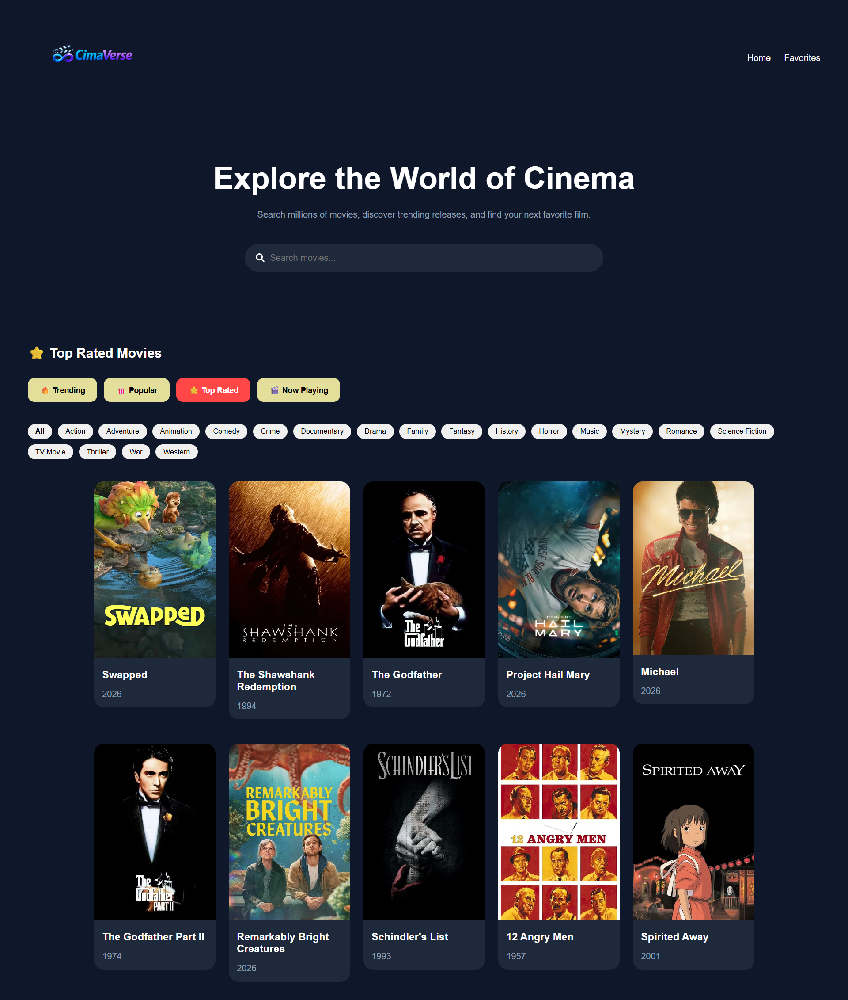
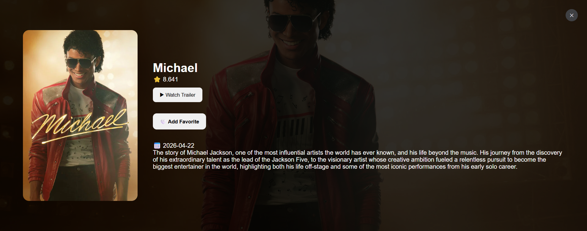

# 🎬 CimaVerse

Modern movie discovery platform built with React and powered by TMDB.

---

## 🌐 Live Demo

https://zeyadbadawyy.github.io/cimaverse

---

## ✨ Features

- 🔎 Search Movies
- 🎥 Movie Details
- ❤️ Favorites System
- 🎭 Genre Filtering
- 🔥 Trending Movies
- 🍿 Popular Movies
- ⭐ Top Rated Movies
- 🎬 Now Playing
- ▶ Watch Trailers

---

## 🛠 Tech Stack

- React
- React Router
- TMDB API
- JavaScript
- CSS3

---

## 📸 Screenshots

### Homepage



---

### Movie Details



---

## 🚀 Installation

```bash
git clone https://github.com/zeyadbadawyy/cimaverse.git

cd cimaverse

npm install

npm run dev
```

---

## 🔮 Future Improvements

- AI-powered movie recommendations
- User watchlists & profiles
- Infinite scrolling and pagination

---

## 📄 Attribution

This product uses the TMDB API but is not endorsed or certified by TMDB.

---

## 👨‍💻 Author

**Zeyad Badawy**

Full-Stack Developer | Software Engineer
